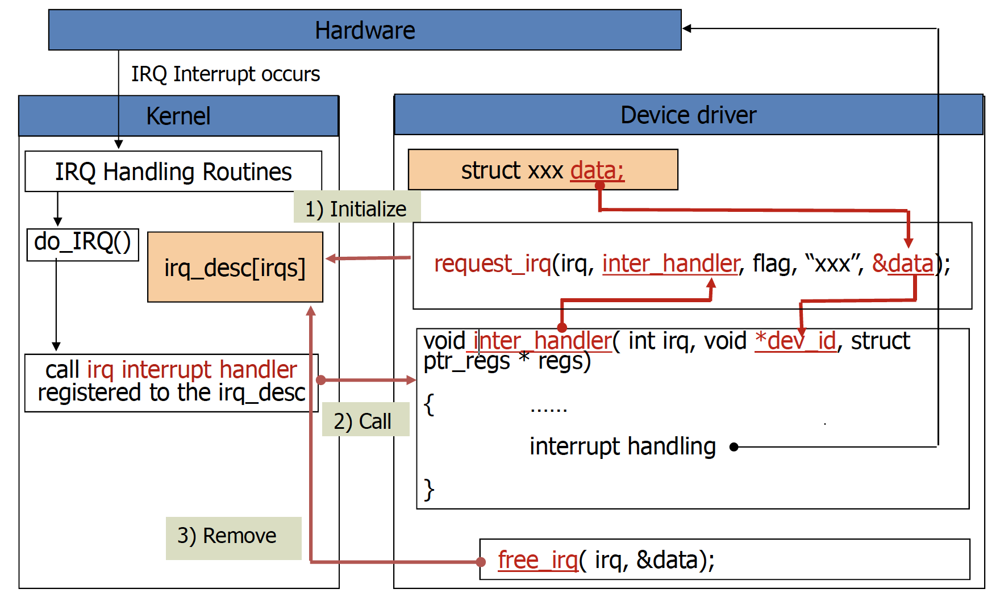

# Interrupt & Interrupt Handler

## Introduction
모든 OS는 Host machine에 연결되어있는 Hardware 기기(ex. HDD, SSD, 마우스, 키보드 등)들을 관리할 수 있어야 한다. 이를 위해 Kernel은 Host system에 연결되어있는 장치들과 통신할 수 있어야한다. 보통 processor(i.e. CPU)들은 이 Hardware들보다 수십 배 빠르므로 Hardware의 응답을 기다리는건 매우 비효율적이다. 그래서 Hardware가 실제로 작업을 완료한 경우에만 응답을 처리하고, 그 사이에 다른 작업들을 수행하도록 하는 것이 효율적이다.

Hardware의 작업 상태를 다루는 방법에는 크게 두 가지가 있다.

* Polling
* Interrupt 

Polling은 kernel이 주기적으로 Hardware의 상태를 확인하는것으로, Hardware가 활성화되지 않았거나 준비되지 않았음에도 계속 반복적으로 상태를 물어보는 오버헤드가 존재한다.

Interrupt는 하드웨어가 kernel에 신호를 보내는 것이다. 따라서 interrupt는 polling과 달리 계속해서 요청을 보내지 않아도 되기 때문에, host system에 가해지는 부하가 매우 적다. 하지만 polling보다는 응답속도가 다소 느리다는 단점이 있다.

이 챕터에서는 interrupt가 무엇인지, kernel이 interrupt handler를 통해 어떻게 interrupt를 다루는지에 대해 살펴본다.

## Interrupt
Interrupt의 종류에는 Software Interrupt와 Hardware Interrupt가 있다. Interrupt를 처리하기 위한 handler들은 Interrupt Descriptor Table(IDT)에 저장되어있으며, interrupt시 이 table로부터 interrupt handler를 호출한다. System call도 interrupt를 통해 수행되므로 system call handler도 IDT에 등록되어있다. IDT entry 수는 0~255로 제한되어있다.

### Hardware Interrupt
Hardware interrupt는 Hardware가 processor에 전기적인 신호를 보내는 것이다. 예를 들어, 키보드의 키를 누르면 processor로 전기적인 신호를 전달하여 OS가 누른 키를 인식하도록 할 수 있는데, 이것이 바로 hardware interrupt이다. Hardware interrupt는 언제든지 발생할 수 있고, 비동기적으로 생성한다. 이를 처리하기 위해 kernel은 언제든지 interrupt될 수 있다.

Hardware에서 생성한 전기적인 신호를 통해 생성된 interrupt는 interrupt controller를 거쳐 processor로 전달된다.

<!-- 그림 삽입 -->

(ref: http://jake.dothome.co.kr/wp-content/uploads/2017/01/interrupt-1a.png)

모든 Hardware는 interrupt line을 통해 interrupt controller와 interrupt line으로 연결되어있다. Interrupt controller는 multiplexer와 같은 역할을 하여 연결된 여러 interrupt line의 input을 processor와 연결된 하나의 line으로 전달한다. Interrupt controller로부터 interrupt가 전달되면 processor는 이를 감지해 현재 실행중인 작업을 잠시 중단하고 interrupt를 처리한다. 그리고 processor는 OS에 이를 알려 처리하도록 한다.

Device 종류마다 고유한 interrupt 값을 가지며, OS는 이를 통해 interrupt를 구별해 이에 연결된 interrupt handler를 통해 interrupt를 처리한다. 이 값들은 interrupt requests(IRQs) line이라고 하며, 각 line에는 값이 할당되어있다. Timer는 0, Keyboard는 1 이런식으로 정적으로 할당 되어있는 경우도 있으나, PCI device의 경우에는 동적으로 값이 할당된다. 어찌됐든 Kernel은 각 interrupt value에 매칭되는 interrupt handler 및 device를 알고 있다.

### Software Interrupt
Hardware interrupt는 비동기적인 interrupt고, system calld이나 exception의 경우는 동기적인 interrupt이다. Exception의 예로는 divide by zero와 같은 programming 오류, page fault와 같이 커널에서 처리해야할 비정상적인 조건들이 있다. 대부분 Hardware interrupt와 비슷한 방식으로 처리한다. 다만, system call을 호출하는 `int 0x80`과 같이 assembly code를 통해 기계어 명령을 통해 실행된다.

Exception의 종류는 크게 세가지가 있다.
* Fault
* Trap
* Aborts

`Fault`는 오류가 수행될 수 도 있는 instruction을 수행하기 전에 발생하는 exception으로, 올바르게 고쳐질 수도 있다. Fault가 고쳐진 instruction은 interrupt를 종료한 후 원래 코드로 돌아갈 수 있다. 대표적인 예로는 `PageFault`가 있다.

`Trap`은 instruction 실행 즉시 보고되는 exception으로, interrupt된 프로그램은 interrupt 종료 시 다시 재개된다. 대표적인 예로는 `Divide by zero`나 `Invalid Memory Access`가 있다. System call도 `trap`을 통해 수행된다.

`Aborts`는 이 exception이 발생한 instruction이 어떤건지 항상 알려주지는 않는다. 그리고 interrupt된 프로그램이 다시 재개되지 않는다. 대표적으로는 `core dumps`가 있다.

## Interrupt Handler
Kernel에서 Hardware등에 대한 interrupt를 처리하는 것을 interrupt handler 또는 ISR(Interrupt Service Routine)라고 한다. Interrupt를 생성하는 장치는 각각 연결된 interrupt handler가 있으며, 보통 Device Driver에 포함되어있다. Device driver는 다른 장에서 다루며, 간략하게 말하면 device를 다루는 kernel code정도로 이해하면 된다.

Interrupt handler를 통해 interrupt를 처리하는 것은 interrupt context라 하는 특수한 context에서 수행된다. 이 context에서 code가 수행될때는 block(ex. sleep, schedule 등 스스로 block되는 행위)할 수 없다. 하지만 interrupt가 수행되는 동안 다른 interrupt에 의해 중단될 수도 있다. 이는 interrupt handler 옵션에 따라 다르다.

같은 종류의 다른 device에서 동일한 interrupt handler를 통해 interrupt를 처리하는 경우 interrupt line과 interrupt value가 같다. Interrupt handler가 실행중일 때 같은 interrupt에 대한 처리가 불가하다. 즉, 해당 interrupt line이 masking되어 비활성화가 된다. 다른 interrupt line은 비활성화 되지 않으므로 interrupt handling이 가능하다. 따라서 nested interrupt가 발생하지 않으며, 동일한 interrupt handler를 동시에 호출하지 않는다.

Interrupt는 언제든지 발생할 수 있다. 여러 Interrupt가 동시에 발생할 수 도 있는데, 이 경우 interrupt 우선순위에 따라 우선순위가 높은 interrupt부터 처리된다.([Appendix A](#appendix-a---interrupt-priority-table) 참조) Interrupt가 발생하면 수행중이던 프로그램은 중지되므로 가능한 빨리 재개하도록 interrupt handler가 신속하게 interrupt를 처리하는것이 중요하다. 그러나 interrupt handler에서 일을 많이 처리해야해서 빠르게 처리 못하는 작업이 있을 수도 있다. 예를 들어 network stack을 거쳐 packet을 처리해야하는 작업이 있다. Interrupt handler에서 꼭 수행해야하지만 시간이 오래 걸리는 것을 interrupt context에서 처리하면 다른 중요한 작업들을 수행할 수 없기 때문에, interrupt의 작업을 다음과 같은 두 가지 부분으로 나눈다.

* Top Halves

Interrupt가 일어나면 즉시 실행되는 부분으로, interrupt 수신 확인이나 Hardware 재설정과 같은 중요한 작업만 우선적으로 수행한다. Interrupt handler가 이에 해당한다.

* Bottom Halves

나중에 수행해도 되는 작업들로, Top halves를 수행하고 남은 Bottom halves는 다양한 방법으로 OS scheduler에 의해 scheduling되어 나중에 처리된다. Bottom havles로 나눠서 수행하려면 반드시 interrupt handler 수행 시 kernel이 re-scheduling하도록 등록해야한다. Bottom halves를 수행하는 종류 세 가지가 있으며, [여기](./03-Interrupt%20Bottom%20Halves.md)에서 다룬다.(나중에 추가 하겠음)

간단하게 살펴보면 다음과 같다.
* `softirq`:
  * process specific kernel thread기반
  * 정적으로 배정됨
* `tasklet`(recommended)
  * 주로 사용됨
  * 한번에 여러 프로세서에서 실행 불가
  * `tasklet`을 등록한 processor에서만 호출 가능.
  * Sleep 불가. (interrupt context에서 수행됨)
* `Work Queue`
  * Sleep 가능. (context에서 수행됨)
  * 다른 processor에서 처리 가능

## Interrupt Context
OS kernel에서 context는 두 가지로 나뉜다.
* Process Context
* Interrupt Context

프로그램 코드를 수행하면 process가 생성이된다. Executable file이 실행되면 program code를 읽어서 program의 address space내에서 실행한다. 일반적으로 program의 실행은 "**user space**"에서 수행된다. Program 실행 중 System call 호출 등을 통해 kernel에 진입하면 "**kernel space**"로 전환된다. 이 시점에서 kernel은 'process 대신 수행되고 있는 "**process context**"에 있다'고 한다. Process context에 있는 kernel thread는 sleep이 가능하고 선점가능하다. 즉, `schedule()`을 통해 scheduler를 불러 schedule out될 수 있다.

Interrupt context는 interrupt handler를 실행하는 경우의 kernel thread의 context이다. 이 상태에서는 sleep이 불가하는 등 process context인 상태에서 호출할 수 있는 kernel 함수의 일부를 사용할 수 없다. Interrupt handler는 자신의 stack을 가질 수 없고, interupt된 process의 stack을 공유한다. 보통 kernel stack은 두 페이지(8KB or 16KB)로 제한되어있으므로, 이 context에서는 데이터 할당을 더 유의해야한다.

## Interrupt Control
Kernel code에서 synchronization 등을 위해 interrupt를 제어할 필요가 있다. 예를 들어, A라는 데이터를 다른 thread들이 동시에 변경할 수 없도록 데이터 변경 code를 critical section으로 설정해 수행중이라고 하자. 그런데 interrupt가 발생해 interrupt handler에서 같은 data를 변경한다면 interrupt가 종료되어 다시 원래 수행중인 코드로 돌아갔을 때 여러 문제가 생길 수 있다. 그러나 현재 프로세서에서의 interrupt system을 비활성화 한다면 적어도 interrupt handler 수행으로 인한 data access는 보호할 수 있다. Linux에서는 다음과 같은 function을 통해 interrupt control을 지원한다.

| Function | Description |
| --- |---|
| `local_irq_disable()` |현재 CPU의 interrupt를 disable |
| `local_irq_enable()` |현재 CPU의 interrupt를 enable |
| `local_irq_save()` |현재 CPU의 irq 상태를 저장하고 interrupt disable |
| `local_irq_restore()` |현재 CPU에서 저장해둔 irq 상태를 복구 |
| `disable_irq()`|특정 interrupt line을 모든 CPU에 대해 disable함 (어떤 handler도 이 function return전에는 동작하지 않고 있음을 보장. 돌고있던 handler 끝날때까지 대기)|
|`disable_irq_nosync()`|특정 interrupt line을 모든 CPU에 대해 disable함|
|`enable_irq()`|특정 interrupt line을 모든 CPU에 대해 enable함|
|`irqs_disabled()`|현재 CPU에서 interrupt가 disable되어있는지 확인(enable-0, disable-1)|
|`in_interrupt()`|현재 interrupt context내 인 경우 nonzero, process context인 경우 0 |
|`in_irq()`|interrupt handler를 수행중이면 nonzero, 그 외의 경우 0|

Interrupt를 껐다 키려면 경우 다음과 같은 과정을 거쳐 진행되어야한다.
```c
unsigned long flags;
local_irq_save(flags);
local_irq_disable();

// Do processing

local_irq_restore(flags);
local_irq_enable();
```

`local_irq_*` function들은 [`include/linux/irqflags.h L79-L151`](https://github.com/torvalds/linux/blob/master/include/linux/irqflags.h#L79-L149)에 정의되어있으며, `local_irq_*` &rarr;  `raw_local_irq_*` &rarr; `arch_local_irq_*` 순으로 wrapping되어있다. 그리고 아키텍쳐마다는 다르나, x86아키텍쳐의 경우 `arch_local_irq_*`은 `native_local_irq_*`을 호출하고 있다.

`irq_disable`의 경우 assembly code로 `cli`를 호출하며, `irq_enable`은 assembly code로 `sti`를 호출한다.
관련 코드는 [`arch/x86/include/asm/irqflags.h L19-L95`](https://github.com/torvalds/linux/blob/master/arch/x86/include/asm/irqflags.h#L19-L95)에 정의되어있다.

## Managing Interrupt
Device driver에서 interrupt는 다음과 같은 lifecycle을 갖는다.



### Registering Interrupt Handler

Interrupt handler를 IDT에 등록하는 방법은 다음과 같다.
```c
int request_irq(unsigned int irq, // IDT entry number
    irq_handler_t handler, // interrupt handler
    unsigned long flags, // interrupt types
    const char *name, // interrupt name
    void *dev // Used for shared interrupt
)
```
1번째 인자인 `irq`(iDT entry number)는 동적으로 주어지는것이 아니라 등록시 static하게 함수 인자로 넣어야한다.

3번째 인자로 사용되는 Interrupt handler flag에는 여러 종류가 있으며, [`include/linux/interrupt.h#L38-L78`](https://github.com/torvalds/linux/blob/master/include/linux/interrupt.h#L38-L78)에 정의되어있다.
Interrupt handler flag들은 서로 다른 bit를 사용하므로 `or` 연산을 통해 여러 flag를 사용할 수 있다. Interrupt handler flag들은 모두 앞에 `IRQF`라는 접미어를 갖는다.

몇 가지 interrupt handler flag를 살펴보면 다음과 같다.

* `IRQF_SHARED` : 여러 device간에 공유될 수 있는 interrupt
* `__IRQF_TIMER` : 이 interrupt는 timer interrupt임
* `IRQF_IRQPOLL` : polling에 사용되는 interrupt
* `IRQF_PERCPU` : CPU 당 존재하는 interrupt (다른 CPU와 공유하지 않음)
* (`IRQF_DISABLED`는 deprecated되었음)

5번째 인자로 사용되는 `void *dev`는 여러 device들이 같은 IRQ를 사용하는 경우 어떤 device가 해당 IRQ를 사용하는지 interrupt handler 내에서 구별하기 위한 용도로 사용된다. `IRQF_SHARED`옵션이 활성화 되어 여러 device가 같은 interrupt handler를 사용하면 IDT의 해당 entry에 linked list 형태로 등록된다. 사용하지 않는 경우 `NULL`을 넘긴다.

`void *dev`는 `IRQF_SHARED`가 활성화 되지 않은 경우에도 사용될 수 있다. 이 경우, device driver와 interrupt handler간 데이터 공유를 위해 사용된다.

**주의할점**: `request_irq`는 등록 중 sleep이 가능하므로 interrupt context에서는 사용이 불가능하다.


### Freeing an Interrupt Handler
Interrupt handler는 여러 device가 사용할 수 있다. IDT에서 삭제하는 방법은 다음과 같다.

```c
void free_irq(unsigned int irq, void *dev)
```
`IRQF_SHARED`로 등록한 경우 irq number 뿐만 아니라, interrupt handler 등록시 넘겼던 `void *dev`가 필요하다. `IRQF_SHARED`로 등록하지 않은 경우 `NULL`을 넘기면 된다.

### Interrupt Handler 작성
Interrupt handler는 다음과 같은 형태를 가져야한다.
```c
static irqreturn_t intr_handler(int irq, void *dev)
```

Interrupt를 top과 bottom으로 나눠서 처리하고자 하면 반드시 bottom halves에 해당하는 부분을 Kernel에 예약해야한다.

# Appendix

## Appendix A - Interrupt Priority Table
```
+----------------------------------------------------------------+
|              |                                                 |
|   Priority   | Description                                     |
|              |                                                 |
+--------------+-------------------------------------------------+
|              | Hardware Reset and Machine Checks               |
|     1        | - RESET                                         |
|              | - Machine Check                                 |
+--------------+-------------------------------------------------+
|              | Trap on Task Switch                             |
|     2        | - T flag in TSS is set                          |
|              |                                                 |
+--------------+-------------------------------------------------+
|              | External Hardware Interventions                 |
|              | - FLUSH                                         |
|     3        | - STOPCLK                                       |
|              | - SMI                                           |
|              | - INIT                                          |
+--------------+-------------------------------------------------+
|              | Traps on the Previous Instruction               |
|     4        | - Breakpoints                                   |
|              | - Debug Trap Exceptions                         |
+--------------+-------------------------------------------------+
|     5        | Nonmaskable Interrupts                          |
+--------------+-------------------------------------------------+
|     6        | Maskable Hardware Interrupts                    |
+--------------+-------------------------------------------------+
|     7        | Code Breakpoint Fault                           |
+--------------+-------------------------------------------------+
|     8        | Faults from Fetching Next Instruction           |
|              | Code-Segment Limit Violation                    |
|              | Code Page Fault                                 |
+--------------+-------------------------------------------------+
|              | Faults from Decoding the Next Instruction       |
|              | Instruction length > 15 bytes                   |
|     9        | Invalid Opcode                                  |
|              | Coprocessor Not Available                       |
|              |                                                 |
+--------------+-------------------------------------------------+
|     10       | Faults on Executing an Instruction              |
|              | Overflow                                        |
|              | Bound error                                     |
|              | Invalid TSS                                     |
|              | Segment Not Present                             |
|              | Stack fault                                     |
|              | General Protection                              |
|              | Data Page Fault                                 |
|              | Alignment Check                                 |
|              | x87 FPU Floating-point exception                |
|              | SIMD floating-point exception                   |
|              | Virtualization exception                        |
+--------------+-------------------------------------------------+
```
(Ref: https://0xax.gitbooks.io/linux-insides/content/Interrupts/linux-interrupts-1.html)
