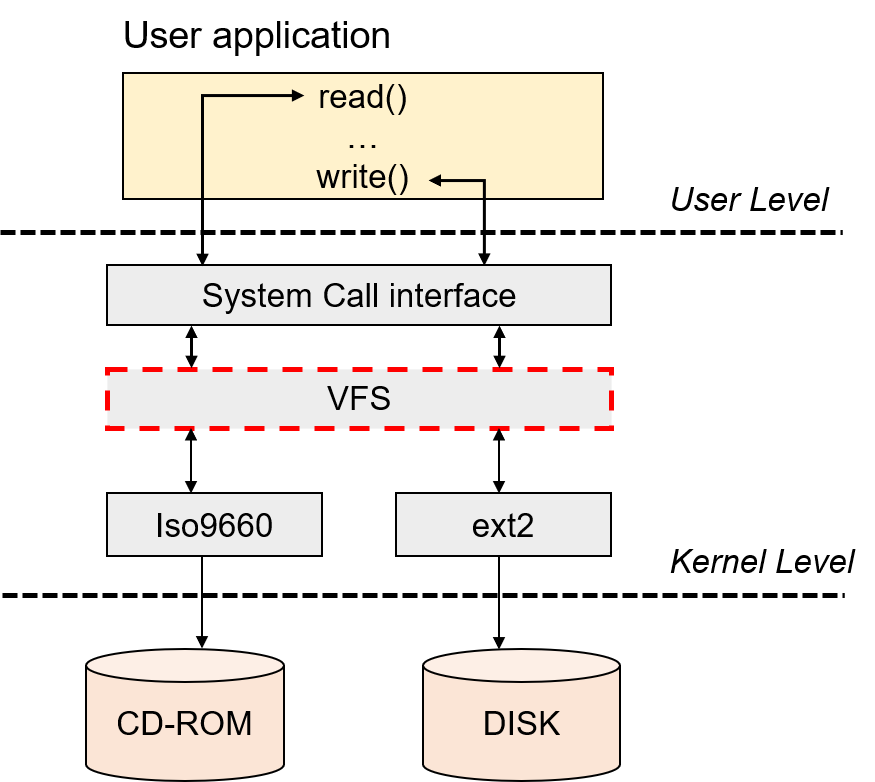
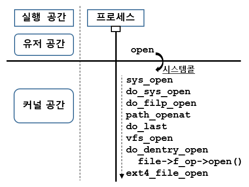
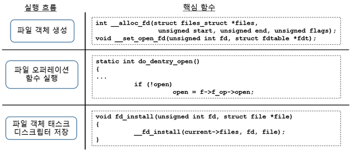
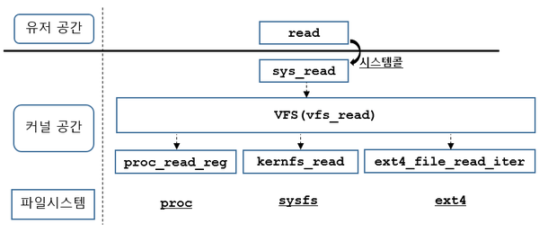
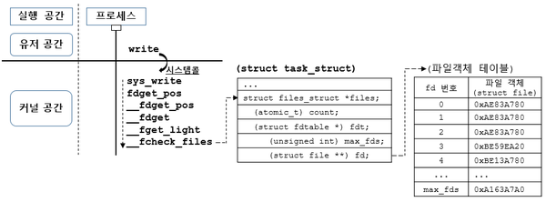
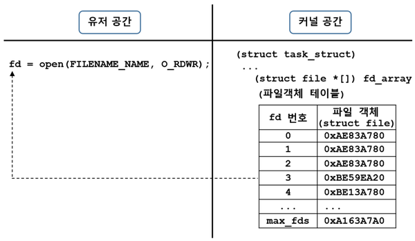
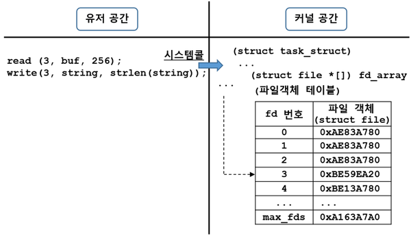
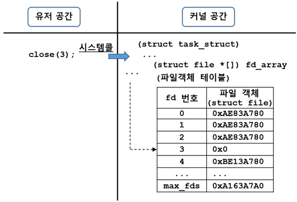

# Chapter 7. VFS(Virtual File System) 

------

[TOC]

## VFS(가상 파일 시스템)란?

> *"가상(virtual)이란 객체 지향에서 말하는 추상화와 유사한 개념임. 특정 모듈의 상세한 기능을 숨기고 인터페이스 용으로 선언된 특정 함수로만 다른 계층과 인터페이싱하는 방법.*"

VFS는 파일시스템 위에 있는 계층으로 파일시스템 계층에 접근하기 전 실행함. 파일시스템을 관리할 수 있는 공통 자료구조(**슈퍼블록(superblock) 객체**, **아이노드(inode) 객체**, **파일(file) 객체**, **덴트리(dentry) 객체**)로 파일시스템 속성을 관리하며 함수 오퍼레이션을 써서 파일시스템별 세부 함수를 호출.

파일시스템 인터페이스를 user application에 제공하고, 모든 파일시스템은 가상 파일시스템을 통해 접근 가능하다. 유저 입장에서는 open(), write(), read() 함수와 같은 리눅스 표준 함수를 써서 파일에 접근하므로  리눅스 커널에 파일 시스템이 하나인 것처럼 느낄 수 있다.



그림1 : user-level과 kernel-level 사이에서 파일 시스템 계층.

[그림 1]에서 system call 수행 과정을 살펴보자.
VFS는 open(), write(), read() 함수를 user application에서 호출하면 system call실행을 통해 파일 시스템에 접근할 수 있는 <u>소프트웨어 계층</u>임.


#### VFS가 지원하는 파일 시스템

- **디스크 기반 파일 시스템**

 : 로컬 디스크 파티션의 기억 장소 또는 디스크를 흉내내는 몇 가지 다른 장치(USB 플래시 드라이브 같은)를 관리
 : Ext2, Ext3, Ext4, MS-DOS, FAT, NTFS, SYSV 등

- **네트워크 파일 시스템**

 : 네트워크로 연결된 다른 컴퓨터의 파일 시스템을 쉽게 접근가능하게 함
 : NFS(Network File System), AFS(앤드류 파일 시슽엠) 등

- **특수 파일 시스템**

 : /proc 파일 시스템, /tmp 파일 시스템 등


#### VFS 를 쓰는 이유

1. **새로운 파일시스템을 적용해도 유저 어플리케이션나 디바이스 드라이버 코드는 호환성을 유지**하며 개발할 수 있다. 가상 파일시스템에서 **추상화 인터페이스**를 지원하기 때문.

2. 가상 파일시스템 계층에서 제공하는 함수는 대부분 vfs_xxx() 형태로 유저 어플리케이션에서 open(), write() 함수를 호출하면 시스템 콜이 실행되고 가상 파일 시스템 계층을 접근.

   

------

## VFS 자료구조(datastructure)

파일시스템별 속성과 디렉토리 그리고 메타데이터를 관리하는 구조체를 **파일시스템 공통 파일 모델**이라함.

리눅스 커널 VFS에서 다양한 파일 시스템을 지원하기 위해 공통으로 파일을 관리할 수 있는 객체를 선언함.

| 객체 종류                         | 구조체             |
| :-------------------------------- | :----------------- |
| 슈퍼블록 객체 (superblock object) | struct super_block |
| 아이노드 객체 (inode object)      | struct inode       |
| 덴트리 객체 (dentry object)       | struct dentry      |
| 파일 객체 (file object)           | struct file        |

 예시를 통해 각 객체가 어떻게 활용되고 접근되는지 알아보자.

다음은 "/home/dcclab/grade.txt" 라는 파일에 접근하는 과정이다.

1. 파일이 위치한 디렉토리를 검색. 
2. "/home/dcclab/" 디렉토리에서 "grade.txt" 파일을 찾았다면, 파일을 열기전에 파일의 형태와 권한 그리고 어떤 프로그램으로 실행할지 점검.
3. "grade.txt" 파일이 read와 write권한이 있다면 vi 에디터와 같은 프로그램을 열어 read/write를 할 것이다.
4. 만약 /proc/interrupts 와 같은 특수한 파일일 경우에는 읽기만 가능.

- 1단계에서는 파일이 위치한 디렉토리를 검색할때 **dentry object**로 디렉토리 정보를 얻음. 디렉토리 위치와 관계를 관리하는 객체를 dentry객체라 하며 모든 디렉토리는 dentry에서 관리함. <u>(dentry = directory entry)</u> 

  **dentry object는 해당 파일에 대한 특정 디렉토리를 관리하는 속성 정보를 표현함.**

  

- 2단계에서는 파일을 찾으면 파일의 상세 정보가 저장되어 있는 **inode** 정보를 읽음. inode에는 파일이 수정된 시간과 접근한 시간 그리고 권한정보가 모두 저장되어 있음. 

  **inode object는 각 파일 그 자체를 관리하고 표현하는 모든 속성과 동작 정보를 저장하고 있다.**

  

- 3단계, 파일을 열어서 텍스트를 입력하고 쓸 때 동작은 **file object**에 정의되어 있다. 파일의 속성과 위치에 따라 파일 시스템 별로 파일을 읽거나 쓸때 VFS에서 해당 파일 시스템에서 지원하는 read/write 함수로 연결해줌.

  **file object는 프로세스가 오픈한 파일을 어떻게 다루고 상호 동작하는지에 대한 정보를 표현함. 이 정보는 프로세스가 파일을 열고 파일을 닫을 때까지 커널 메모리에 상주.** 

  

- 가장 중요한 파일시스템에 대한 상세정보는 **superblock object**에서 확인가능함. 파일 시스템별로 등록된 superblock 함수 오퍼레이션으로 inode를 생성하고 해제한다.

  

------

### 슈퍼블록 객체(Superblock object)

*Superblock object는 파일 시스템에 대한 메타 정보와 각 파일시스템 별  superblock 함수 오퍼레이션으로 구성됨. 구체적으로 파일시스템 마운트 정보와 실행 플래그를 저장한다.*

> 디스크 저장 기반 ext4 파일시스템과 시스템 정보를 ram에서 출력하는 proc 파일시스템은 **서로 다른** superblock 마운트와 실행 플래그 정보를 가짐.

**struct super_block** 구조체 내 **struct super_operations** 멤버는 해당 파일 시스템을 처리하는 함수 목록을 알 수 있다.


#### - struct super_block 구조체 분석

다음 구조체를 분석하여 슈퍼블락이 어떤 파일시스템 정보를 저장하고 있는지 알아보자.

[수퍼블록 구조체 코드](https://github.com/torvalds/linux/blob/386403a115f95997c2715691226e11a7b5cffcfd/include/linux/fs.h#L1422)

```c++
struct super_block {
	struct list_head	s_list;	        수퍼 블록을 연결하는 연결 리스트 포인터
	dev_t	s_dev;	                    디바이스 식별자
	unsigned char	s_blocksize_bits;	비트 단위의 블럭 크기
	unsigned long	s_blocksize;	    바이트 단위의 블럭 크기
	loff_t	s_maxbytes;	                파일의 최대 크기
	struct file_system_type	*s_type;    파일시스템 유형
	const struct super_operations	*s_op;    	수퍼 블럭 오퍼레이션
	const struct dquot_operations	*dq_op; 	사용량을 제한 함수 오퍼레이션
	const struct quotactl_ops	*s_qcop; 	    사용량을 제어하는 함수 오퍼레이션
	const struct export_operations  	*s_export_op;	파일 시스템 외부 함수 오퍼레이션
	unsigned long	s_flags;	                마운트 플래그
	unsigned long	s_magic;	                파일시스템의 고유번호(매직넘버)
	struct dentry	*s_root;	        파일시스템의 루트 디렉터리에 대한 dentry 객체
	struct rw_semaphore	s_umount;	    마운트를 해제할 때 쓰는 세마포어
	Int	s_count;	                    슈퍼블록 참조 카운터
	atomic_t	s_active;	            보조 참조 카운터
	const struct xattr_handler  **s_xattr;	    수퍼 블록 확장 속성 구조체를 가리키는 포인터
	struct hlist_bl_head	s_anon;	     익명 dentry들의 리스트 항목
	struct block_device	*s_bdev; 	     관련 블럭 드라이버 장치를 가리키는 포인터
	struct hlist_node	s_instances; 	 특정 파일 시스템 유형의 수퍼 블럭 객체들이 모여있는 리스트를 가리키는 포인터
	struct quota_info	s_dquot;	사용량 제한 관련 옵션
	char	s_id[32];	            수퍼블록 블럭 장치의 이름
```


<u>위 속성중 자세히 보아야 할 멤버를 살펴보자.</u>


[**s_flags**](https://github.com/torvalds/linux/blob/386403a115f95997c2715691226e11a7b5cffcfd/include/linux/fs.h#L1357) : 파일 시스템의 실행 옵션을 알 수 있다.

```c++
#define SB_RDONLY	 1	    /* Mount read-only */
#define SB_NOSUID	 2	    /* Ignore suid and sgid bits */
#define SB_NODEV	 4	    /* Disallow access to device special files */
#define SB_NOEXEC	 8	    /* Disallow program execution */
#define SB_SYNCHRONOUS	16	/* Writes are synced at once */
#define SB_MANDLOCK	64	    /* Allow mandatory locks on an FS */
#define SB_DIRSYNC	128	    /* Directory modifications are synchronous */
#define SB_NOATIME	1024	/* Do not update access times. */
#define SB_NODIRATIME	2048	/* Do not update directory access times */
#define SB_SILENT	32768
#define SB_POSIXACL	(1<<16)	    /* VFS does not apply the umask */
#define SB_KERNMOUNT	(1<<22) /* this is a kern_mount call */
#define SB_I_VERSION	(1<<23) /* Update inode I_version field */
#define SB_LAZYTIME	(1<<25)     /* Update the on-disk [acm]times lazily */
```

*proc 파일 시스템의 경우 s_flags는 SB_RDONLY | SB_NOEXEC | SB_NODIRATIME 와 같은 매크로 OR 연산이다.

proc 파일시스템은 램에서만 시스템 정보를 출력하는 역할을 하기때문에 유저가 임의로 파일을 생성하거나 지울수없다. (커널에서만 가능)


[**s_iflags**](https://github.com/torvalds/linux/blob/386403a115f95997c2715691226e11a7b5cffcfd/include/linux/fs.h#L1393) : 커널 내부 슈퍼블락 동작을 위해 추가된 플래그.

```c++
/* sb->s_iflags */
#define SB_I_CGROUPWB	0x00000001	/* cgroup-aware writeback enabled */
#define SB_I_NOEXEC	0x00000002	/* Ignore executables on this fs */
#define SB_I_NODEV	0x00000004	/* Ignore devices on this fs */
#define SB_I_MULTIROOT	0x00000008	/* Multiple roots to the dentry tree */
```


#### - 슈퍼블록 함수 오퍼레이션

https://elixir.bootlin.com/linux/v4.14.70/source/fs/inode.c

```C++
1 static stuct inode *alloc_inode(struct super_block *sb) 
2 {
3	struct inode *inode;
4
5	if (sb->s_op->alloc_inode)
6		inode = sb->s_op->alloc_inode(sb);
```

**line 5**에 **if** 문 sb->s_op->alloc_inode 멤버가 **NULL**이 아닌지 검사함.

***sb**는 포인터형 변수, 구조체 **struct super_block**의 멤버인 **s_op**에 접근.


다음은 **struct super_block** 구조체의 선언부, **s_op**멤버의 의미를 살펴보자.

https://elixir.bootlin.com/linux/v4.14.70/source/include/linux/fs.h

```c++
1 struct super_block {
2	struct list_head	s_list;
...
3	const struct super_operations *s_op;
```

**line 3** 에 **struct super_operations** 구조체로 정의된 ***s_op**를 파일시스템별 **함수 오퍼레이션** 이라고함.


**struct super_operations** 구조체를 보면서 함수 오퍼레이션의 의미를 확인해보자.

https://elixir.bootlin.com/linux/v4.14.70/source/include/linux/fs.h

```c++
1 struct super_operations {
2   struct inode *(*alloc_inode)(struct super_block *sb);
3	void (*destroy_inode)(struct inode *);
4
5 	void (*dirty_inode) (struct inode *, int flags);
6	int (*write_inode) (struct inode *, struct writeback_control *wbc);
...
```

**struct super_operations** 멤버들은 모두 함수 포인터 연산을 위한 주소를 담고있음.


다시 **static stuct inode *alloc_inode()** 함수 코드를 보자. **line 6**의 의미는 **alloc_inode()**가 저장한 함수 주소를 호출하는 코드임.  

> ext4 파일시스템의 경우 **line 6**의 **ext4_alloc_inode()** 함수를 실행하고 proc 파일 시스템은 **proc_alloc_inode()** 함수를 호출할 것.

왜냐하면, 각 파일 시스템 별로 alloc_inode 멤버에 서로 다른 함수가 지정되어있기 때문. (**ext4_alloc_inode()**와 **proc_alloc_inode()**.) 


- <u>그렇다면 **alloc_inode()** 함수는 어떤 기능을 수행할까?</u> 

:  파일을 생성할 때 해당 파일의 inode를 생성함. 


*이렇게 VFS는 파일시스템 계층 위에서 파일시스템별로 등록된 함수를 실행시키는 역할을 수행한다.*

------

 [슈퍼 블록 파일 오퍼레이션 관련 시스템 콜](http://rousalome.egloos.com/9995793) 

 [슈퍼블록 정보를 statfs 시스템 콜로 읽는 과정](http://rousalome.egloos.com/9996101) 

------

### 아이노드 객체(inode object)

*inode object는 각 파일 그 자체를 관리하고 표현하는 모든 속성과 동작 정보를 저장하고 있다.*

#### - struct inode 구조체 분석

아이노드에 대한 세부속성을 알아보자.

[inode 구조체 코드](https://github.com/torvalds/linux/blob/386403a115f95997c2715691226e11a7b5cffcfd/include/linux/fs.h#L626)

```c++
struct inode {
	umode_t			i_mode;
	unsigned short		i_opflags;
	kuid_t			i_uid;
	kgid_t			i_gid;
	unsigned int		i_flags;
...
	const struct inode_operations	*i_op;
	struct super_block	*i_sb;
	struct address_space	*i_mapping;
...
}	
```


struct inode 구조체 각각의 필드에 대한 설명이다.

```c++
const struct inode_operations	*i_op;	inode 연산
struct super_block	*i_sb;				수퍼 블록 객체를 가리키는 포인터
struct address_space	*i_mapping;		address_space를 가리키는 포인터
unsigned long	i_ino;	                inode 번호
const unsigned int	i_nlink;           	하드 링크의 갯수
dev_t	i_rdev;							실제 장치 식별자
loff_t	i_size;							바이트 단위의 파일 크기
struct timespec	i_atime,				마지막으로 파일에 접근한 시간
	i_mtime,							마지막으로 파일에 쓴 시간
	i_ctime;							마지막으로 inode를 변경한 시간 
unsigned short	i_bytes;				파일의 마지막 블록에 있는 바이트 갯수
unsigned int	i_blkbits;				비트 단위의 블록 사이즈
blkcnt_t	i_blocks;					파일의 블록 갯수
unsigned long	i_state;				inode 상태 플래그
unsigned long	dirtied_when;			inode가 dirty 상태가 된 시간
unsigned long	dirtied_time_when;		inode가 dirty 상태에서 변경된 시간
struct hlist_node	i_hash;				해쉬 리스트를 가리키는 포인터
struct list_head	i_sb_list;			수퍼 블록의 inode 리스트를 가리키는 포인터
atomic_t	i_count;					사용 카운터
atomic_t	i_writecount;				쓰기 프로세스를 위한 사용 카운터
```


<u>stuct inode 구조체 필드 중 중요한 필드를 살펴보자.</u>


[**umode_t i_mode**](https://github.com/torvalds/linux/blob/1c1ff4836fdab94c7c15b23be57bf64c1e56a36f/include/uapi/linux/stat.h) : 파일 종류와 동작 권한과 같은 inode 상태를 저장함. 아래 플래그를 OR 비트 연산한 결과를 저장한다. ( OR이라 되있는데 밑에 보면 AND임.. )

```c++
#define S_IFMT  00170000	파일 종류 식별하기 위한 마스크 비트
#define S_IFSOCK 0140000	소켓
#define S_IFLNK	 0120000	링크 파일
#define S_IFREG  0100000	일반 파일
#define S_IFBLK  0060000	블록 다바이스용 파일
#define S_IFDIR  0040000	디렉토리 파일
#define S_IFCHR  0020000	캐릭터 다바이스용 파일
#define S_IFIFO  0010000	FIFO 용 파일
#define S_ISUID  0004000	Set user id 비트
#define S_ISGID  0002000	Set group id 비트(여기에 만들어진 파일은 만드는 프로세스의 유효 그룹 ID가 아니라 디렉터리에서 그룹 ID를 상속받고, S_ISGID 비트 설정도 얻습니다)
#define S_ISVTX  0001000	끈끈한(sticky) 비트. 이 비트가 디렉터리에 설정되면, 해당 디렉터리의 파일은 파일의 소유자, 디렉터리의 소유자 또는 권한 있는(privileged) 프로세스에 의해서만 이름이 바뀌거나 삭제될 수 있음을 의미합니다.
```

i_mode 필드를 사용하는, 파일 오픈시 호출되는 may_open() 함수를 살펴보자.

[int may_open](https://github.com/torvalds/linux/blob/94f2630b18975bb56eee5d1a36371db967643479/fs/namei.c#L3021)

```c++
1 static int may_open(const struct path *path, int acc_mode, int flag)
2 {
3 	struct dentry *dentry = path->dentry;
4 	struct inode *inode = dentry->d_inode;
5	int error;
6
7	if (!inode)							// 아이노드가 유효한지 체크.
8		return -ENOENT;
9
10	switch (inode->i_mode & S_IFMT) {	//여기서 부터 아이노드 모드에 따라 파일 제어.
11	case S_IFLNK:
12		return -ELOOP;
13	case S_IFDIR:
14		if (acc_mode & MAY_WRITE)
15			return -EISDIR;
16		break;
17	case S_IFBLK:
18 	case S_IFCHR:
19 		if (!may_open_dev(path))
20			return -EACCES;
21		/*FALLTHRU*/
22	case S_IFIFO:
23	case S_IFSOCK:
24		flag &= ~O_TRUNC;
25		break;
	}
...
```

**line 10** 에서 i_mode를 S_IFMT와 AND연산을 수행함.

**line 11 ~ 16** 코드와 **22 ~ 25** 코드는 파일 종류가 심볼링 링크, 디렉토리, 소켓이나 FIFO이면 에러코드를 반환함. 


다음으로 S_ISDIR()과 S_ISREG() 매크로 사용 예를 보자.

[long vfs_truncate](https://github.com/torvalds/linux/blob/94f2630b18975bb56eee5d1a36371db967643479/fs/open.c#L69)

```c++
1 long vfs_truncate(const struct path *path, loff_t length)
2 {
3    struct inode *inode;
...
4    inode = path->dentry->d_inode;
5    mnt = path->mnt;
6
7    /* For directories it's -EISDIR, for other non-regulars - -EINVAL */
8    if (S_ISDIR(inode->i_mode))
9        return -EISDIR;
10    if (!S_ISREG(inode->i_mode))
11        return -EINVAL;
```

**line 8~9**를 보자. 

아이노드 객체 i_mode필드를 S_ISDIR() 매크로에 전달하여 파일이 디렉토리 타입인지 점검.

**line 10~11**에서는 파일이 일반 파일타입인지 점검.


다음은 inode 파일의 세부 동작을 저장하는 플래그이다. 매크로를 AND 연산한 결과를 저장한다.

[**unsigned long i_state;**](https://github.com/torvalds/linux/blob/94f2630b18975bb56eee5d1a36371db967643479/include/linux/fs.h#L2144)

```c++
#define I_DIRTY_SYNC		(1 << 0)
#define I_DIRTY_DATASYNC	(1 << 1)
#define I_DIRTY_PAGES		(1 << 2)
#define __I_NEW			3
#define I_NEW			(1 << __I_NEW)
#define I_WILL_FREE		(1 << 4)
#define I_FREEING		(1 << 5)
#define I_CLEAR			(1 << 6)
#define __I_SYNC		7
#define I_SYNC			(1 << __I_SYNC)
#define I_REFERENCED		(1 << 8)
#define __I_DIO_WAKEUP		9
#define I_DIO_WAKEUP		(1 << __I_DIO_WAKEUP)
#define I_LINKABLE		(1 << 10)
#define I_DIRTY_TIME		(1 << 11)
#define __I_DIRTY_TIME_EXPIRED	12
#define I_DIRTY_TIME_EXPIRED	(1 << __I_DIRTY_TIME_EXPIRED)
#define I_WB_SWITCH		(1 << 13)
#define I_OVL_INUSE		(1 << 14)
#define I_CREATING		(1 << 15)
```


#### - 아이노드 함수 오퍼레이션

[struct inode_operations](https://github.com/torvalds/linux/blob/94f2630b18975bb56eee5d1a36371db967643479/include/linux/fs.h#L1863) 아이노드 함수 오퍼레이션을 살펴보자.

```c++
struct inode_operations {
	struct dentry * (*lookup) (struct inode *,struct dentry *, unsigned int);
	const char * (*get_link) (struct dentry *, struct inode *, struct delayed_call *);
	int (*permission) (struct inode *, int);
	struct posix_acl * (*get_acl)(struct inode *, int);

	int (*readlink) (struct dentry *, char __user *,int);

	int (*create) (struct inode *,struct dentry *, umode_t, bool);
	int (*link) (struct dentry *,struct inode *,struct dentry *);
	int (*unlink) (struct inode *,struct dentry *);
	int (*symlink) (struct inode *,struct dentry *,const char *);
	int (*mkdir) (struct inode *,struct dentry *,umode_t);
	int (*rmdir) (struct inode *,struct dentry *);
	int (*mknod) (struct inode *,struct dentry *,umode_t,dev_t);
	int (*rename) (struct inode *, struct dentry *,
			struct inode *, struct dentry *, unsigned int);
	int (*setattr) (struct dentry *, struct iattr *);
	int (*getattr) (const struct path *, struct kstat *, u32, unsigned int);
	ssize_t (*listxattr) (struct dentry *, char *, size_t);
	int (*fiemap)(struct inode *, struct fiemap_extent_info *, u64 start,
		      u64 len);
	int (*update_time)(struct inode *, struct timespec64 *, int);
	int (*atomic_open)(struct inode *, struct dentry *,
			   struct file *, unsigned open_flag,
			   umode_t create_mode);
	int (*tmpfile) (struct inode *, struct dentry *, umode_t);
	int (*set_acl)(struct inode *, struct posix_acl *, int);
} ____cacheline_aligned;
```

구조체 필드를 보면 모두 함수포인터로 구성되어있음.

각 파일시스템 별로 inode를 세부 함수 포인터로 실행하는 역할을 수행한다.


그렇다면 위의 필드중 몇가지 중요한 코드를 살펴보자.

- **lookup** : dentry 객체 파일 이름에 해당하는 inode를 관리하는 디렉토리를 찾는다.

lookup 함수 오퍼레이션은 다양한 조건에서 looup_open(), lookup_real(), lookup_slow() 함수에서 수행함.

[lookup_open 함수](https://github.com/torvalds/linux/blob/4591343e3560d51fa37a24cd262192a7b889a6a3/fs/namei.c#L3086)

```c++
static int lookup_open(struct nameidata *nd, struct path *path,
			struct file *file,
			const struct open_flags *op,
			bool got_write)
{
	struct dentry *dir = nd->path.dentry;
	struct inode *dir_inode = dir->d_inode;
	...
	if (d_in_lookup(dentry)) {
	struct dentry *res = dir_inode->i_op->lookup(dir_inode, dentry, // lookup 수행
						    nd->flags);
	d_lookup_done(dentry);
	if (unlikely(res)) {
		if (IS_ERR(res)) {
			error = PTR_ERR(res);
```


- **permission** : inode에 해당하는 파일이 지정된 접근 모드가 허용되는지 체크. 권한이 있으면 0을 반환, 아니면 음수 error 매크로를 반환함.

[do_inode_permission() 함수](https://github.com/torvalds/linux/blob/4591343e3560d51fa37a24cd262192a7b889a6a3/fs/namei.c#L382)

```c++
static inline int do_inode_permission(struct inode *inode, int mask)
{
	if (unlikely(!(inode->i_opflags & IOP_FASTPERM))) {
		if (likely(inode->i_op->permission))
			return inode->i_op->permission(inode, mask); // permission 함수 수행
```


- **readlink** : dentry가 가리키는 심볼릭 링크의 전체 디렉토리 경로를 지정한 버퍼 크기만큼 복사.

[vfs_readlink() 함수](https://github.com/torvalds/linux/blob/4591343e3560d51fa37a24cd262192a7b889a6a3/fs/namei.c#L4668)

```c++
int vfs_readlink(struct dentry *dentry, char __user *buffer, int buflen)
{
	struct inode *inode = d_inode(dentry);
...
	if (unlikely(!(inode->i_opflags & IOP_DEFAULT_READLINK))) {
		if (unlikely(inode->i_op->readlink))
			return inode->i_op->readlink(dentry, buffer, buflen); // readlink 함수 수행
```


- **link** : 하드링크를 새로 생성. 실행 결과 dir 디렉토리 안에 old_dentry가 가리키는 파일을 참조함. 새로운 하드링크는 new_dentry가 지정한 이름으로 저장됨.

[vfs_link() 함수](https://github.com/torvalds/linux/blob/4591343e3560d51fa37a24cd262192a7b889a6a3/fs/namei.c#L4148)

```c++
int vfs_link(struct dentry *old_dentry, struct inode *dir, struct dentry *new_dentry, struct inode **delegated_inode)
{
...
	else {
		error = try_break_deleg(inode, delegated_inode);
		if (!error)
			error = dir->i_op->link(old_dentry, dir, new_dentry); // link 함수 수행
	}
```


- **mkdir** : 터미널에서 새로운 디렉토리를 생성할때 mkdir 명령어를 입력할 때 실행됨. 인자로 전달되는 dentry 객체와 연관된 디렉토리용 inode생성.

[vfs_mkdir() 함수](https://github.com/torvalds/linux/blob/4591343e3560d51fa37a24cd262192a7b889a6a3/fs/namei.c#L3751)

```c++
int vfs_mkdir(struct inode *dir, struct dentry *dentry, umode_t mode)
{
...
	error = dir->i_op->mkdir(dir, dentry, mode); /// mkdir 함수 오퍼레이션 수행
	if (!error)
		fsnotify_mkdir(dir, dentry);
```


- **mknod** : dentry 객체와 연관된 장치파일과 특수파일용 inode를 생성함. mknodat 시스템 콜과 연동하여 동작한다.

[vfs_mknod() 함수](https://github.com/torvalds/linux/blob/4591343e3560d51fa37a24cd262192a7b889a6a3/fs/namei.c#L3650)

```c++
int vfs_mknod(struct inode *dir, struct dentry *dentry, umode_t mode, dev_t dev)
{
...
	error = dir->i_op->mknod(dir, dentry, mode, dev);  // mknode 함수 오퍼레이션 수행
	if (!error)
		fsnotify_create(dir, dentry);
	return error;
}
```


#### - inode 함수 오퍼레이션에서 디렉토리 파일 처리방식

먼저 "/home/pi/sample.txt" 라는 파일이 있다.

여기서 home과 pi는 **디렉토리**이고, sample.txt는 **파일**이다.

<u>**하지만 리눅스 커널에서는 디렉토리고 뭐고 전부다 파일로 간주한다!!**</u>

(대신, home이랑 pi는 파일 타입중 디렉토리 타입으로 보는것임.)

만약, /home/pi 디렉토리에 A란 디렉토리를 생성한다고 가정하면, 리눅스 커널에서는 디렉토리도 파일로 간주하므로 디렉토리를 생성하는 규칙도 inode 오퍼레이션에 추가한 것이다.


**A.** 다음은 ext4 파일시스템에서 디렉토리파일을 관리하는 inode 함수 오퍼레이션이다. 

```c++
(static struct inode_operations) ext4_dir_inode_operations = (
    (struct dentry * (*)()) lookup = 0x80347A70 = ext4_lookup,
    (char * (*)()) get_link = 0x0 = ,
    (int (*)()) permission = 0x0 = ,
    (struct posix_acl * (*)()) get_acl = 0x8036B9E4 = ext4_get_acl,
    (int (*)()) readlink = 0x0 = ,
    (int (*)()) create = 0x803491A4 = ext4_create,
    (int (*)()) link = 0x8034BA18 = ext4_link,
    (int (*)()) unlink = 0x8034B0E4 = ext4_unlink,
    (int (*)()) symlink = 0x8034B670 = ext4_symlink,
    (int (*)()) mkdir = 0x80349700 = ext4_mkdir,
    (int (*)()) rmdir = 0x8034AE44 = ext4_rmdir,
    (int (*)()) mknod = 0x80349020 = ext4_mknod,
    (int (*)()) rename = 0x8034A10C = ext4_rename2,
    (int (*)()) setattr = 0x80334BB4 = ext4_setattr,
    (int (*)()) getattr = 0x8032F904 = ext4_getattr,
    (ssize_t (*)()) listxattr = 0x80368D54 = ext4_listxattr,
    (int (*)()) fiemap = 0x8031A6E0 = ext4_fiemap,
    (int (*)()) update_time = 0x0 = ,
    (int (*)()) atomic_open = 0x0 = ,
    (int (*)()) tmpfile = 0x80349F88 = ext4_tmpfile,
    (int (*)()) set_acl = 0x8036BC44 = ext4_set_acl)
```

**B.** 그리고 일반 파일을 관리하는 inode함수 오퍼레이션이다.

```c++
 (static struct inode_operations) ext4_file_inode_operations = (
    (struct dentry * (*)()) lookup = 0x0 = ,
    (char * (*)()) get_link = 0x0 = ,
    (int (*)()) permission = 0x0 = ,
    (struct posix_acl * (*)()) get_acl = 0x8036B9E4 = ext4_get_acl,
    (int (*)()) readlink = 0x0 = ,
    (int (*)()) create = 0x0 = ,
    (int (*)()) link = 0x0 = ,
    (int (*)()) unlink = 0x0 = ,
    (int (*)()) symlink = 0x0 = ,
    (int (*)()) mkdir = 0x0 = ,
    (int (*)()) rmdir = 0x0 = ,
    (int (*)()) mknod = 0x0 = ,
    (int (*)()) rename = 0x0 = ,
    (int (*)()) setattr = 0x80334BB4 = ext4_setattr,
    (int (*)()) getattr = 0x8032F9C8 = ext4_file_getattr,
    (ssize_t (*)()) listxattr = 0x80368D54 = ext4_listxattr,
    (int (*)()) fiemap = 0x8031A6E0 = ext4_fiemap,
    (int (*)()) update_time = 0x0 = ,
    (int (*)()) atomic_open = 0x0 = ,
    (int (*)()) tmpfile = 0x0 = ,
    (int (*)()) set_acl = 0x8036BC44 = ext4_set_acl)
```

A와 B를 보면 A는 대부분 inode 함수 오퍼레이션으로 함수가 지정되어있고, B는 대부분 필드가 0x0으로 함수포인터 지정을 안함. 


***이와 같이 파일의 타입에 따라 inode 함수 오퍼레이션의 동작이 다름을 알 수 있다.*** 


------

### 덴트리 객체(Dentry object)

*dentry object는 해당 파일에 대한 특정 디렉토리를 관리하는 속성 정보를 표현함.*


User space에서 디렉토리 패스 정보가 포함된 파일 정보를 인자로 system call을 호출한다.

```c++
1 int main() 
2 {
3    int fd = 0;
4    ssize_t read_buf_size;
5   
6    fd = open("/home/pi/sample.txt", O_RDWR);
...
7 }
```

물론, user space에서 open()함수를 호출하면 kernel space에서 system call handler인 sys_open()함수를 호출할 것이다. 이 과정에서 dentry 객체는 다음 과정을 수행한다.

- "/home" 디렉토리에서 pi 디렉토리를 검색.
- pi 디렉토리가 유효한지와 접근 가능한지를 점검.
- pi 디렉토리 내 sample.txt 파일이 있는지 체크.
- 디렉토리의 상관 관계를 정확히 체크해 dentry 구조를 생성 : "/home" 하위 디렉토리에 pi가 있고 pi 하부 디렉토리에 sample.txt 

위와 같이 디렉토리 경로를 해석하고, 디렉토리 간 관계를 점검하는 동작을 dentry 객체를 통해 수행한다.


#### - struct dentry 구조체 분석

[struct dentry](https://github.com/torvalds/linux/blob/7ada90eb9c7ae4a8eb066f8e9b4d80122f0363db/include/linux/dcache.h#L89)

```c++
struct dentry {
	/* RCU lookup touched fields */
	unsigned int d_flags;			/* protected by d_lock */
	seqcount_t d_seq;				/* per dentry seqlock */
	struct hlist_bl_node d_hash;	/* lookup hash list */
	struct dentry *d_parent;		/* parent directory */
	struct qstr d_name;
	struct inode *d_inode;			/* Where the name belongs to - NULL is
					 				* negative */
	unsigned char d_iname[DNAME_INLINE_LEN];	/* small names */

	/* Ref lookup also touches following */
	struct lockref d_lockref;		/* per-dentry lock and refcount */
	const struct dentry_operations *d_op;
	struct super_block *d_sb;		/* The root of the dentry tree */
	unsigned long d_time;			/* used by d_revalidate */
	void *d_fsdata;					/* fs-specific data */

	union {
		struct list_head d_lru;		/* LRU list */
		wait_queue_head_t *d_wait;	/* in-lookup ones only */
	};
	struct list_head d_child;		/* child of parent list */
	struct list_head d_subdirs;		/* our children */
	/*
	 * d_alias and d_rcu can share memory
	 */
	union {
		struct hlist_node d_alias;	/* inode alias list */
		struct hlist_bl_node d_in_lookup_hash;	/* only for in-lookup ones */
	 	struct rcu_head d_rcu;
	} d_u;
} __randomize_layout;
```


dentry 구조체 필드중 중요한 속성을 몇가지 알아보자.

| Type                           | Field       | Explanation                                                  |
| ------------------------------ | ----------- | ------------------------------------------------------------ |
| unsigned int                   | d_flags     | 덴트리 상태 플래그                                           |
| struct dentry                  | *d_parent   | 부모 디렉터리의 dentry 객체                                  |
| struct qstr                    | d_name      | 덴트리 이름                                                  |
| struct inode                   | *d_inode    | 덴트리에 해당하는 아이노드                                   |
| unsigned char                  | d_iname[36] | 덴트리 약칭 이름                                             |
| const struct dentry_operations | *d_op       | 덴트리 오퍼레이션 함수 테이블                                |
| struct super_block             | *d_sb       | 파일의 수퍼 블록 객체                                        |
| void                           | *d_fsdata   | 파일시스템에 따른 포인터 매개 변수                           |
| struct list_head               | d_child     | 디렉터리에 대해서, 동일한 부모 디렉터리 내 디렉터리 dentry 리스트를 가리키는 포인터 |
| struct list_head               | d_subdirs   | 렉터리에 대해서, 하위 디렉터리 dentry들의 리스트 헤드        |


------

### 파일 객체(file object)

*유저는 파일을 생성하고 읽고 쓰기 위한 용도로 쓴다. 이 때 파일 동작에 대한 상세한 규칙과 속성은 파일 객체에서 확인할 수 있다.*


예를 들어,

> 만약 라즈베리파이에서 2개 Geany프로그램에서 1개 파일을 열 수 있습니다. 이 때 몇 개 파일 객체가 생성될까요? 2개 파일 객체는 각각 프로세스 별로 생성합니다. 파일 객체는 이렇게 파일을 오픈하고 읽고 쓰는 상황에서 프로세스가 파일을 관리하기 위해 생성합니다.


#### - struct file 구조체 분석

[struct file](https://github.com/torvalds/linux/blob/7ada90eb9c7ae4a8eb066f8e9b4d80122f0363db/include/linux/fs.h#L935)

```c++
struct file {
	union {
		struct llist_node	fu_llist;
		struct rcu_head 	fu_rcuhead;
	} f_u;
	struct path		f_path;
	struct inode		*f_inode;	/* cached value */
	const struct file_operations	*f_op;
```

파일 객체 멤버 중 중요한 항목을 살펴보자.

| Type                         | member        | Explanation                           |
| :--------------------------- | ------------- | ------------------------------------- |
| struct path                  | f_path        | 가상 파일 시스템 마운트 정보와 덴트리 |
| struct inode                 | *f_inode      | 아이노드                              |
| const struct file_operations | *f_op         | 파일 오퍼레이션                       |
| spinlock_t                   | f_lock        | 파일 객체 구조체에서 쓰는 락          |
| atomic_long_t                | f_count       | 파일 객체가 참조된 횟수               |
| unsigned int                 | f_flags       | 파일을 오픈할 때 설정한 플래그        |
| fmode_t                      | f_mode        | 파일 접근 시 모드                     |
| loff_t                       | f_pos         | 파일을 처리할 때 오프셋               |
| void                         | *private_data | 디바이스 드라이버에서 쓰는 핸들       |


파일 객체 멤버중 많이 쓰이는 f_flags와 f_mode에 대해 알아보자.

[f_flags](https://elixir.bootlin.com/linux/v4.14.70/source/include/uapi/asm-generic/fcntl.h) : 지정된 옵션에 따라 파일을 제어한다.

```
O_RDONLY		읽기 전용
O_WRONLY		쓰기 전용
O_RDWR			읽기와 쓰기 모두 가능
O_CREAT			지정한 파일이 없으면 파일을 생성
O_EXCL			O_CREAT와 함께 설정하면 생성할 파일이 이미 있을 때 
open() 			함수가 실행되지 않아 이전 파일 보존할 수 있음
O_TRUNC			기존의 파일 내용을 모두 삭제
O_APPEND		파일에 추가하여 쓰기 동작이 수행되게 open 후에 쓰기 포인터가 파일의 끝에 위치함
O_NOCITTY		열기 대상이 터미널일 경우, 이 터미널이 플로그램의 제어 터미널로 할당 안함
O_NONBLOCK		읽을 내용이 없을 때 읽을 내용이 있을 때까지 기다리지 않고 바로 복귀
O_SYNC			쓰기 요청을 한 후 쓴 내용이 디스크에 기록될 때 까지 기다림
```


[f_mode](https://elixir.bootlin.com/linux/v4.14.70/source/include/uapi/asm-generic/fcntl.h) : 파일 오픈한 이력과 세부 동작 상태를 저장함.

```
FMODE_READ			읽기를 위해 파일을 오픈한 상태
FMODE_WRITE			쓰기를 위해 파일을 오픈한 상태
FMODE_LSEEK			파일 포인터 위치를 바꾸는 동작
FMODE_PREAD			pread를 통해 파일 접근
FMODE_PWRITE 		pwrite 시스템 콜로 파일 접근
FMODE_EXEC			파일 실행을 위해 오픈됨 
FMODE_NDELAY 		O_NDELAY 옵션으로 파일을 오픈한 상태
FMODE_EXCL 			O_EXCL 옵션으로 파일을 오픈한 상태
FMODE_WRITE_IOCTL 	ioctl 시스템 콜로 파일이 오픈된 상태
```


#### - 파일객체 함수 오퍼레이션

VFS에서 파일시스템 별로 파일을 열고 쓰고 읽는 함수 포인터 테이블을 지원하는데, 이를 파일 오퍼레이션 이라고 하며 다음 헤더파일에 저장 되어있다.

[/include/linux/fs.h](https://elixir.bootlin.com/linux/v4.14.70/source/include/linux/fs.h)

```c++
struct file_operations {
	struct module *owner;
	loff_t (*llseek) (struct file *, loff_t, int);
	ssize_t (*read) (struct file *, char __user *, size_t, loff_t *);
	ssize_t (*write) (struct file *, const char __user *, size_t, loff_t *);
	ssize_t (*read_iter) (struct kiocb *, struct iov_iter *);
	ssize_t (*write_iter) (struct kiocb *, struct iov_iter *);
	int (*iterate) (struct file *, struct dir_context *);
	int (*iterate_shared) (struct file *, struct dir_context *);
	unsigned int (*poll) (struct file *, struct poll_table_struct *);
	long (*unlocked_ioctl) (struct file *, unsigned int, unsigned long);
	long (*compat_ioctl) (struct file *, unsigned int, unsigned long);
	int (*mmap) (struct file *, struct vm_area_struct *);
	int (*open) (struct inode *, struct file *);
	int (*flush) (struct file *, fl_owner_t id);
	int (*release) (struct inode *, struct file *);
	int (*fsync) (struct file *, loff_t, loff_t, int datasync);
	int (*fasync) (int, struct file *, int);
...
	ssize_t (*dedupe_file_range)(struct file *, u64, u64, struct file *,
			u64);
} __randomize_layout;
```

위 함수 오퍼레이션중 가장 많이 쓰는 멤버들을 알아보자.

**llseek** : loff_t (*llseek) (struct file *file, loff_t offset, int whence)

파일 포인터를 offset 값으로 갱신.


**read** : ssize_t (*read) (struct file *file, char __user *buf, size_t count, loff_t *offset);

파일 오프셋(offset) 위치에서 count 바이트만큼 읽는다. 이 동작을 수행하면서 파일 오프셋인 *offset은 업데이트.


**write** : ssize_t (*write) (struct file *file, const char __user buf*,  size_t count, loff_t offset*);

파일의 오프셋(*offset) 위치에 count 바이트만큼 buf에 있는 데이터를 써줌.


**poll** : unsigned int (*poll) (struct file *, struct poll_table_struct *);

파일 동작을 점검하고 파일에 대한 동작이 발생하기 전까지 휴면 상태에 진입.

------

## VFS 시스템 콜(system call)

### open()

파일 객체를 열때 세부 동작임.

User space에서 open()함수를 실행하면 kernel space에서 다음과 같은 함수 흐름을 확인할 수 있다.



user space에서 **open()** 함수를 호출하면 system call을 발생시켜 실행 흐름이 kernel space로 바뀜. 이후 system call handler 함수인 **sys_open()** 함수가 실행되고 ext4 파일시스템의 파일 오픈함수인 **ext4_file_open()**이 호출된다.



파일 open시 실행 흐름은 3단계로 분류할 수 있다.

**1단계** : 파일 객체 생성
파일 오픈을 할 때 가장 먼저 파일 객체를 생성함. __alloc_fd() 함수를 호출.

https://elixir.bootlin.com/linux/v4.14.70/source/fs/file.c

```c++
int get_unused_fd_flags(unsigned flags)
{
	return __alloc_fd(current->files, 0, rlimit(RLIMIT_NOFILE), flags);
}
```

*current는 현재 실행중인 프로세스 테스크 디스크립터에 접근하는 매크로임.


**2단계** : 파일 오퍼레이션 실행
각 파일시스템에서 관리하는 파일 종류별로 등록된 open()함수를 호출.
ext4 라면 ext4_file_open() 함수를 실행하겠지..

```c++
if (fd >= 0) {
		struct file *f = do_filp_open(dfd, tmp, &op);
```


**3단계** : 파일 객체 테스크 디스크립터 등록
프로세스에서 관리하는 파일 디스크립터 테이블에 파일 객체를 등록함.

```c++
10		if (IS_ERR(f)) {
11			put_unused_fd(fd);
12			fd = PTR_ERR(f);
13		} else {
14			fsnotify_open(f);
15			fd_install(fd, f);
16		}
```

fd_install() 함수를 호출하여 파일 디스크립터를 프로세스 테스크 디스크립터에 저장.

**파일을 open해서 읽거나 쓸 때 프로세스가 파일 객체와 디스크립터를 관리한다.**


그래서 파일을 오픈하면 프로세스는 기존에 저장된 파일 디스크립터 테이블에 접근하여, 파일 디스크립터를 로딩함.

만약, user application에서 파일 디스크립터를 닫으면 이에 맞게 프로세스 테스크 디스크립터의 파일 디스크립터 테이블에서 해당 파일 디스크립터를 지움.


***파일 디스크립터로 inode, superblock, file operation 등 모든 파일을 관리할 수 있는 객체에 접근할 수 있다.***


### read()

user space에서 read()함수를 호출했을때 파일 시스템 별로 관리하는 파일 객체에서 파일 오퍼레이션을 수행하는 방식이다.



user space에서 **read()** 함수를 호출하면 system call을 발생시켜 실행 흐름이 kernel space로 바뀜. 이후 system call handler 함수인 **sys_read()** 함수가 실행되고 ext4 파일시스템의 파일 오픈함수인 **ext4_file_read()**이 호출된다.


**sys_read() 함수 동작은 3단계로 분류 할 수 있다.**

```c++
1 SYSCALL_DEFINE3(read, unsigned int, fd, char __user *, buf, size_t, count)
2 {
3	struct fd f = fdget_pos(fd);
4	ssize_t ret = -EBADF;
5
6	if (f.file) {
7		loff_t pos = file_pos_read(f.file);
8		ret = vfs_read(f.file, buf, count, &pos);
9		if (ret >= 0)
10			file_pos_write(f.file, pos);
11		fdput_pos(f);
12	}
13	return ret;
14 }
```

- **1단계 **: 파일 객체 읽기
  프로세스의 파일 디스크립터 테이블에서 파일 디스크립터에 해당하는 파일 객체를 읽음.
  **line 3**에서 해당 동작을 수행. 파일 디스크립터인 fd를 읽는다.

- **2단계** : 파일 오퍼레이션 실행 
  파일별 지정한 read() 함수 포인터 실행.
  **line 6** 에서 file 멤버가 유효한지 점검하고.
  **line 7** 에서 파일 포인터위치를 읽음.
  **line 8** 에서 vfs_read() 호출 

- **3단계 **: 파일 포인터 위치 정보를 갱신.
  버퍼에 설정한 버퍼 사이즈만큼 읽기 동작을 수행했으니 파일 포인터 위치를 이동.
  **line 9~10** 에서 파일 포인터 위치를 변경함.


다음은 vfs_read() 함수이다. 

```c++
1 ssize_t vfs_read(struct file *file, char __user *buf, size_t count, loff_t *pos)
2 {
3	ssize_t ret;
4
5	if (!(file->f_mode & FMODE_READ))     // 파일 모드를 점검하여 예외처리
6		return -EBADF;
7	if (!(file->f_mode & FMODE_CAN_READ)) // 파일을 읽을 수 있는지 점검 
8		return -EINVAL;
9	if (unlikely(!access_ok(VERIFY_WRITE, buf, count)))
10		return -EFAULT;
11
12	ret = rw_verify_area(READ, file, pos, count);
13	if (!ret) {
14		if (count > MAX_RW_COUNT)
15			count =  MAX_RW_COUNT;
16		ret = __vfs_read(file, buf, count, pos);	// __vfs_read 호출
...
17	}
18
19	return ret;
20 }
```

파일 객체 f_mode 속성을 읽고 예외처리를 수행한 다음 __vfs_read() 함수를 호출한다.


다음은 __vfs_read() 함수 코드이다.

```c++
1 ssize_t __vfs_read(struct file *file, char __user *buf, size_t count,
2		   loff_t *pos)
3 {
4	if (file->f_op->read)
5		return file->f_op->read(file, buf, count, pos);
6	else if (file->f_op->read_iter)
7		return new_sync_read(file, buf, count, pos);
8	else
9		return -EINVAL;
10 }
```

file->f_op->read 멤버가 유효한 함수 주소를 가리킬 경우 실행한다.

struct file 구조체 멤버중 f_op에 접근해서 read란 포인터가 가리키는 주소를 호출함. (함수 오퍼레이션)


### write()



​					그림 . fdget_pos() 함수를 호출하여 프로세스의 파일 디스크립터 테이블에 접근하는 실행 흐름.

### close()


------

## 프로세스가 파일 객체 자료구조를 관리하는 방법

파일을 오픈하면 프로세스가 파일 디스크립터와 파일 객체를 관리한다 라고 했다. 

*그렇다면 프로세스 입장에서 파일 디스크립터와 파일 객체를 어떻게 관리할까?*


위의 설명중 

```c++
fd = open(FILENAME_NAME, O_RDWR);
```

와 같은 형태로 파일에 대한 정보인 파일 디스크립터를 반환 한다고 했다.

이때, 파일 디스크립터는 정수형인데

```c++
read_buf_size = read(fd, buf, 256);
printf("%s", buf);
    
memset(buf, 0x0, sizeof(buf));
	
write(fd, string, strlen(string));
```

위와 같이 read, write 등 함수를 호출할 때 인자로 사용한다.


**여기서!!** 

user application은 **fd**라는 정수형 인자로 **파일의 상세 내용을 모르는채로 파일 관리를 쉽게**한다.** 
<u>그렇다면 이 fd는 누가 관리하는걸까??</u>  


*"프로세스"*


**프로세스가 파일 디스크립터를 어떻게 관리하는지 3단계로 분류해보자.**

**1 단계** : 파일 객체 및 파일 디스크립터 생성 후 프로세스 파일 디스크립터 테이블에 등록



각 프로세스마다 파일 객체를 관리하는 **파일 디스크립터 테이블**이 있다.
위 그림에서 파일 디스크립터가 3번인데, kernel space에서는 파일 디스크립터 배열 3번에 해당하는 파일 객체로 파일을 관리하는 것임.


**2 단계** : 프로세스 파일 디스크립터 테이블에서 파일 디스크립터와 파일 객체 로딩



User space에서 3번 파일 디스크립터로 파일을 읽고 쓰고 파일 포인터를 설정함.
이때, kernel space에서는 테이블의 3번 배열에 해당하는 파일객체(0xBE59EA20)로 파일을 읽고 쓰고 동작을 관리함.


**3 단계** : 프로세스 파일 디스크립터 테이블에서 파일 디스크립터와 파일 객체 삭제



파일을 닫을 때 user space에서 close() 함수를 호출하는데 이 때 정수형 파일 디스크립터를 인자로 전달함.

그리고 kernel space의 파일 디스크립터 테이블 3번의 파일객체는 0x0으로 초기화 된다.


**만약에!!!**

close() 함수를 **호출**해서 파일 디스크립터를 **해제**한 후 다시 해당 파일 디스크립터로 write(), read(), lseek() 함수를 호출하면 어떻게 될까??


*"파일 디스크립터가 초기화 되어있으므로 error 매크로가 return되어 동작을 멈출것이다."*


## References

http://www.bricktou.com/fs/open_vfs_truncate_en.html

http://rousalome.egloos.com/9995793

https://dev-ahn.tistory.com/97

https://www.kernel.org/doc/html/latest/filesystems/vfs.html

